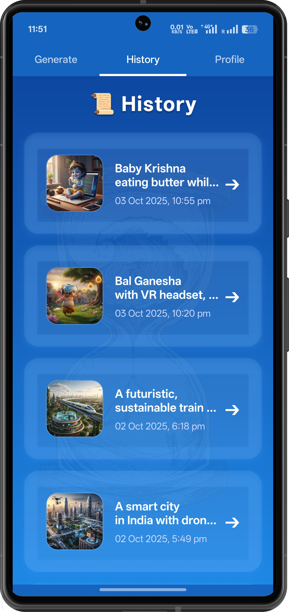
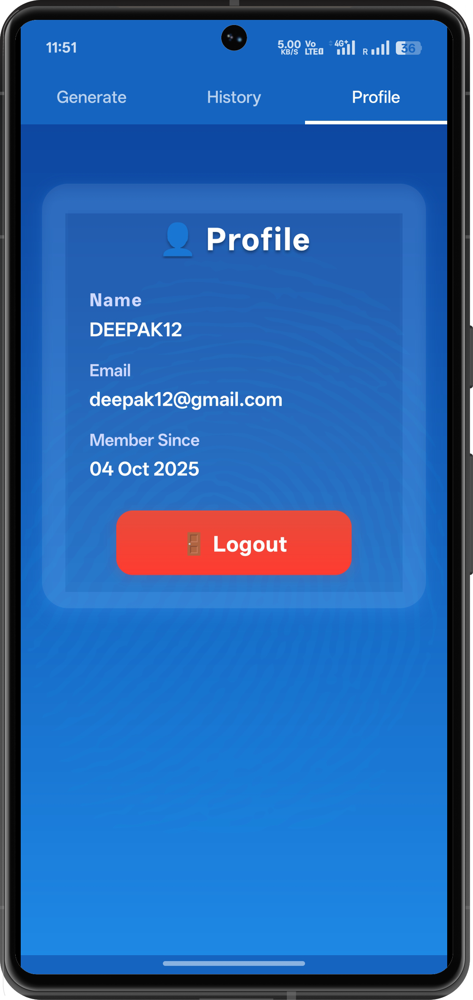

<h1 align="left" style="background: linear-gradient(90deg, #007CF0, #00DFD8); -webkit-background-clip: text; color: transparent;">
✨ GenieIMG — AI Image Generator App
</h1>

  <i>Unleash your creativity and craft stunning visuals from simple text prompts.</i> 
  <b>GenieIMG</b> is a next-generation, full-stack mobile application that brings your imagination to life using the power of <b>Generative AI</b>.

<!-- break -->

---

## 📸 Visual Showcase

| App Overview | Signup |
|---------------|---------|
|  |  |

| Generate Home | Generate with Keyboard | History |
|----------------|------------------------|----------|
|  |  |  |

| Output 1 | Output 2 | Output 3 |
|-----------|-----------|-----------|
|  |  |  |

| Output 4 | Output 5 | Profile |
|-----------|-----------|----------|
|  |  |  |

---

## 🎨 Features

| Feature | Description |
|----------|-------------|
| 🧠 **Prompt-to-Image Generation** | Generate unique, high-quality images simply by typing a descriptive text prompt. |
| 🔐 **User Authentication** | Secure **Signup** and **Login** for managing user sessions. |
| 🕓 **Personalized History** | Stores and displays previously generated images for quick access. |
| 🖼️ **Image Details View** | Tap on any history image to view full-screen, see the prompt, and download/share it. |
| 👤 **User Profile** | Displays user info (Name, Email, Member Since) with a Logout option. |
| 🌈 **Sleek & Intuitive UI** | Blue-gradient theme with smooth **Reanimated transitions** for a polished user experience. |

---

## 💻 Technical Stack & Architecture

### 🪄 Frontend (Mobile App)
- ⚛️ **React Native (Expo)** — Cross-platform app for iOS & Android  
- 🎞️ **React Native Reanimated** — For fluid animations and transitions  
- 💅 **Tailwind CSS / NativeWind** — Utility-first and consistent styling  
- 🎨 **Custom Blue Gradient Theme** — Modern and appealing visual design  

### ⚙️ Backend (API & Database)
- 🧩 **MERN Stack** — Powering backend and data storage  
  - 🗄️ **MongoDB** — For storing user data and generated image history  
  - 🚀 **Express.js** — For API routes and middleware  
  - 🧠 **Node.js** — For server-side logic and API handling  

### 🤖 AI / Generative Engine
- 🪶 **Stability AI (or similar API)** — Converts text prompts into high-quality AI-generated images  

---

## ⚙️ Installation & Setup

### 🔧 Prerequisites
Make sure you have:
- Node.js and npm installed  
- Android Studio (with SDK and emulator) or Xcode (for iOS)  
- React Native CLI configured (`npx react-native doctor`)

### 📦 Steps

## 1. Clone the repository
git clone https://github.com/Deepak-9988/GenieIMG.git
cd GenieIMG

## 2. Install dependencies
npm install

## 3. Add environment variables
## Create a .env file in the root directory and add:
MONGO_URI=your_mongo_connection_string
AI_API_KEY=your_stability_ai_api_key

## 4. Start the Metro bundler
npx react-native start

## 5. Run the app on Android
npx react-native run-android

## or on iOS (Mac only)
npx react-native run-ios

# GenieIMG

👨‍💻 Developer  
💻 [GitHub](https://github.com/Deepak-9988)  
📸 [Instagram](https://www.instagram.com/dpk._.dk/)
